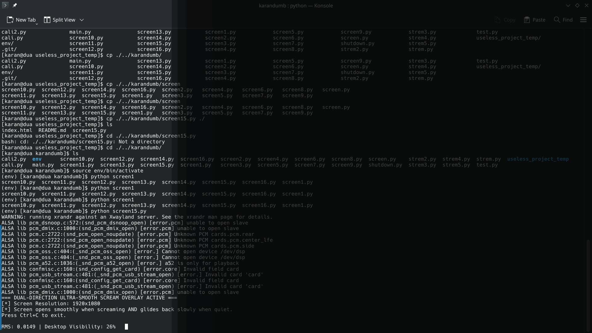
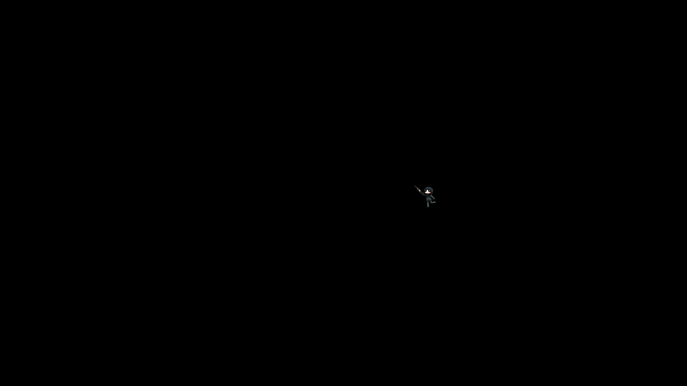

# SCREAM LAPTOP 🎯

## Basic Details
### Team Name: The Dua gng

### Team Members
- Team Lead: SHREERAM V - Ahalia School of Engineering and Technology
- Member 2: KARANJITH KJ - Ahalia School of Engineering and Technology

### Project Description
SCREAM LAPTOP is an audio-reactive privacy and focus system for your computer. By default, your entire screen is covered by a pitch-black void overlay. The only way to reveal your desktop and get work done is by constantly screaming into your microphone.

### The Problem (that doesn't exist)
Laptops are too easy to look at, allowing nosy shoulder-surfers to peek at your private messages and work. Traditional lock screens and privacy filters are far too quiet and polite.

### The Solution (that nobody asked for)
A sound-driven overlay system! Using real-time audio amplitude analysis, your display stays hidden behind a black overlay unless you maintain a high-decibel scream. The louder you scream, the clearer your desktop becomes; as soon as you fall silent, the screen glides smoothly back into total darkness.

---

## Technical Details

### Technologies/Components Used
For Software:
- **Languages used**: Python 3
- **Libraries used**: `PyAudio` (real-time microphone input stream), `NumPy` (RMS volume & array processing)
- **Tools used**: `dzen2` (lightweight X11 overlay renderer), `xrandr` (dynamic resolution detection), `Linux / Bash`

---

### Implementation

#### Installation

##### 1. System Dependencies (Linux / X11)

**Debian / Ubuntu / Pop!_OS:**
```bash
sudo apt-get update
sudo apt-get install dzen2 x11-xserver-utils portaudio19-dev
```

**Arch Linux / Manjaro:**
```bash
sudo pacman -S dzen2 xorg-xrandr portaudio
```

##### 2. Clone Repository & Setup Virtual Environment
```bash
# Clone repository from GitHub
git clone https://github.com/KStupid/useless_project_temp.git
cd useless_project_temp

# Create and activate a Python virtual environment
python -m venv venv
source venv/bin/activate

# Install Python dependencies
pip install -r requirements.txt
```

#### Run
```bash
# Ensure virtual environment is activated
source venv/bin/activate

# Run the scream overlay
python screen15.py
```

---

### Project Documentation

#### Screenshots

*Desktop overlay in action showing screen visibility status based on audio input.*


*SCREAM LAPTOP project demonstration image.*

#### Diagrams
```
+-------------------+      +-------------------+      +-------------------+      +-------------------+
|  Microphone Input | ---> | RMS Volume Calc   | ---> | Exponential Curve | ---> |  dzen2 Black Out  |
|  (PyAudio Stream) |      | (NumPy Array Math)|      | & Alpha Smoothing |      |  Screen Overlay   |
+-------------------+      +-------------------+      +-------------------+      +-------------------+
```
*Workflow: Audio captured -> RMS computed -> Smoothing & quantization -> Dynamic `dzen2` width update.*

---

### Project Demo

#### Video
[Watch Project Demo Video](doc/Screencast_20260912_075946.webm)
*Demonstration of screen opening as sound levels rise and returning to black when quiet.*

---

## Team Contributions
- **SHREERAM V**: Idea generation and planning.
- **KARANJITH KJ**: Coding, bug testing, and implementation.

---
Made with ❤️ at TinkerHub Useless Projects 


